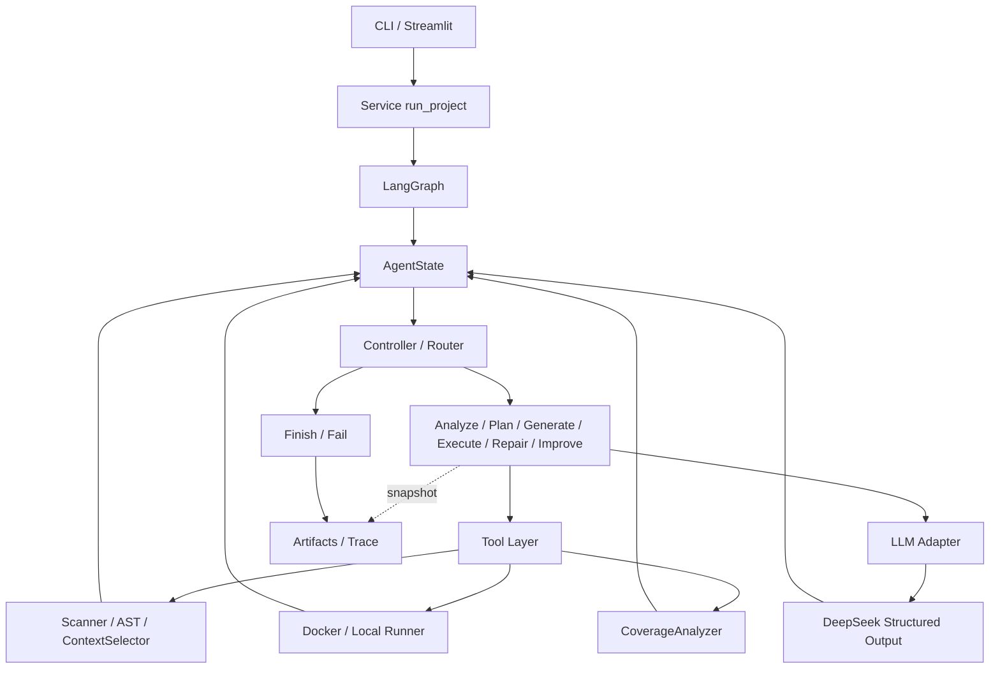
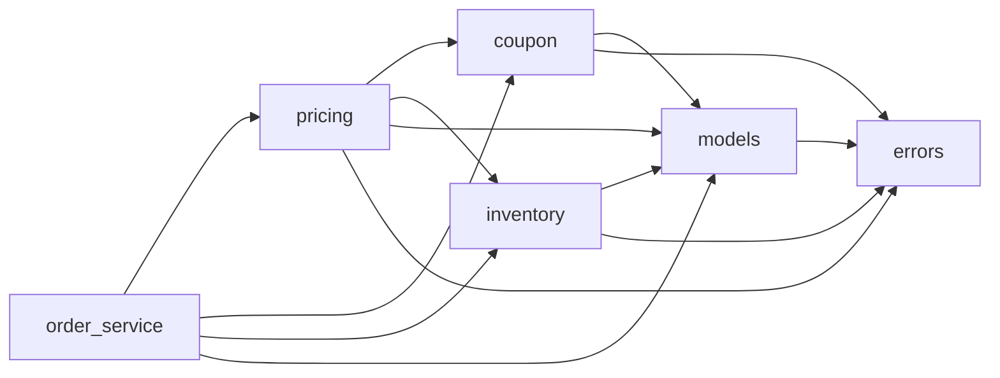

# TestPilot Design

本文解释架构与关键约束；安装、命令、结果与评分入口见 [README.md](README.md)。

## 1. Design Goals

| 目标 | 设计理由 |
|---|---|
| Stateful | 在单次运行中保存索引、测试版本与执行历史，为下一步决策提供记忆。 |
| Tool-Using | 扫描、AST、pytest 和 coverage 由工具给出可核验事实。 |
| Feedback-Driven | 根据 traceback 或缺失覆盖路径修复、补测，直到达标或预算耗尽。 |
| Project-Aware | 结合直接依赖源码与结构理解跨模块契约，避免孤立生成单函数测试。 |
| Bounded | 限制上下文、输出、超时和重试轮次，使失败可终止、可解释。 |

当前是一个主 Agent，LLM 负责语义推理，确定性 Controller 负责调度；不需要将每个工具包装成独立 Agent。

## 2. Overall Architecture

[service.py](testpilot/service.py) 是两个 UI 的共同入口，建立 run、State 和 Graph；[agent](testpilot/agent) 编排节点与条件边；[tools](testpilot/tools) 执行确定性分析；[runners](testpilot/runners) 隔离执行并归一化结果；[LLM](testpilot/llm/client.py) 封装模型协议；[schemas](testpilot/schemas) 与 [reporting](testpilot/reporting/artifacts.py) 提供类型契约及产物。图中工具/模型反馈经节点写回 State，基础工具不负责路由。

## 3. AgentState

[AgentState](testpilot/agent/state.py) 是 Pydantic workflow memory，核心字段分为：

- repository / project index：文件、依赖、已有测试、模块 AST。
- targets / selected context：当前目标与本次选择的上下文。
- test plan / generated tests：结构化计划和测试文件内容。
- execution observation / coverage：当前执行、历史执行、缺失行与分支。
- retry counters / status / history：修复与补测计数、动作、错误及 trace。

State 保存运行所需信息，ContextSelector 决定每次 LLM call 实际看到什么。节点深拷贝 State 后更新；修复/补测清空 `execution_result`，强制新测试重新验收。`state.json` 是精简快照，不包含完整上下文和执行历史；历史执行可在 `rounds/` 查阅，当前不能从快照恢复运行。

## 4. Controller / Router

[decide()](testpilot/agent/controller.py) 是纯状态策略函数：[graph.py](testpilot/agent/graph.py) 从 Controller 开始，按 Action 条件分发，非终止节点执行完都返回 Controller。

**Observation → State update → Decision → Next Action**，按以下优先级决策：

| 当前观察 | 动作 |
|---|---|
| 已有不可恢复错误 | FAIL |
| 无 repository（分析尚未完成） | ANALYZE，建立扫描结果和索引 |
| 无 plan / 无 tests / 当前 tests 尚未运行 | PLAN / GENERATE / EXECUTE |
| pytest 非零退出或超时，修复预算仍有剩余 | REPAIR |
| pytest 通过、coverage 不足，补测预算仍有剩余 | IMPROVE_COVERAGE |
| 测试通过且覆盖率达标；或关闭 coverage 后测试通过 | FINISH |
| 预算耗尽或所需 coverage 缺失 | FAIL |

执行节点还拒绝“零实际通过用例”的假成功。修复和补测不是必经步骤，是否进入取决于工具反馈；两类计数都是整次 run 的全局预算，补测后失败仍消耗同一修复预算。Graph 另按预算计算 recursion limit 防止无限循环。

## 5. Tool Layer

| 工具 / 实现 | 职责 |
|---|---|
| [RepositoryScanner](testpilot/tools/repository_scanner.py) | 递归过滤文件，识别源码、已有测试和依赖声明。 |
| [ASTAnalyzer](testpilot/tools/ast_analyzer.py) | 提取函数、方法、类、签名、分支位置及直接内部依赖。 |
| [ContextSelector](testpilot/tools/context_selector.py) | 按阶段选择目标、依赖和观察，并检查字符预算。 |
| [FileReader](testpilot/tools/file_reader.py) | 处理源码编码，拒绝越界、符号链接和过大文件。 |
| [TestRunner](testpilot/runners/base.py) | 真实执行 pytest，返回退出码、超时、输出及 JUnit 计数。 |
| [CoverageAnalyzer](testpilot/tools/coverage_analyzer.py) | 从 coverage.py JSON 计算目标覆盖率与缺失路径。 |

LLM 负责 planning、generation、repair、coverage supplementation 中的输入组合与断言推理；最终是否通过及覆盖率数值只能来自工具。扫描上限 5000 文件，单次读取上限 512000 bytes，临时副本上限 50 MB。

## 6. Context Engineering

选择顺序：Project Index → current target → target source / AST → direct internal dependencies → relevant signatures / source → stage-specific context。项目结构摘要最多取前 150 项，不递归拼入整个仓库。

| 阶段 | 在目标及直接依赖信息之外附加 |
|---|---|
| PLAN | 已完成的其他目标计划、行为质量策略。 |
| GENERATE | 其他目标计划、已有生成测试；LLM adapter 另追加当前计划。 |
| REPAIR | 所选目标源码与依赖、当前待修复文件、其他文件名、真实执行输出及上次候选校验反馈。 |
| IMPROVE_COVERAGE | 所选目标共同上下文、现有测试、执行观察、missing lines / branch arcs。 |

规划和生成逐模块进行；修复保留所选目标的源码上下文，但每次只携带一个待修复测试文件；补测仍携带全部已有测试。进程输出每个流只保留末尾 16000 bytes，原始 coverage 大 JSON 不进入模型上下文。

项目 [config.yaml](config.yaml) 当前设置 `agent.context_max_chars=100000`，以运行时配置为准。它检查 ContextSelector 序列化 JSON 的字符数，**不是完整模型请求的 token 上限**，也不包含 adapter 后加的 system prompt、schema 和当前计划。超限抛出 ProjectAnalysisError，建议 `--target` 或调高预算，不静默截断源码/JSON。

CLI / Web 均发现当前目录配置；CLI 还支持显式文件：显式文件优先，其次当前目录 YAML，再次内置默认；文件非法即失败。代码 `AppConfig()` 的上下文默认仍是 60000，Web 在配置加载后覆盖界面选项。当前模型的 YAML 与内置默认均为 `deepseek-flash`。

## 7. Test Planning

[TestCasePlan](testpilot/schemas/test_plan.py) 记录目标、`behavior_id`、setup、输入策略、期望、优先级和行为类别。测试数量由行为复杂度决定，不按固定 case 数量拒绝、重试或截断计划。

[提示词](testpilot/prompts/tasks.py) 以 distinct behavior 为优先：同类输入优先 `parametrize`，独立边界测试不再重复同一参数行；阈值两侧、不同异常、状态迁移和交互必须保留。`behavior_id` 用于明确行为意图，**不是确定性去重的唯一键**。

[plan_optimizer](testpilot/tools/plan_optimizer.py) 仅在目标符号、setup、输入策略、期望文本一致时合并 case，保留类别与最高优先级。[test_deduplicator](testpilot/tools/test_deduplicator.py) 在初始生成/新增补测时，只删除同文件内静态可确认重复的简单参数行，优先保留独立边界函数；不猜测不同常量或复杂 fixture 是否语义等价。更广泛的语义去重依靠 prompt 和人工审查。

## 8. Feedback Loops

### Failure Repair Loop

GENERATE → pytest → traceback → repair context → LLM repair → pytest。

从真实 pytest 失败摘要定位测试文件（无法定位时逐文件处理全部生成测试）。DeepSeek adapter 每次只请求一个文件的局部 `old/new` 精确替换，不要求重写整份文件；匹配必须唯一且片段不能重叠，全部替换相对于原文件解析，再还原为 Agent 原有的 TestBundle 接口。未改动内容和其他文件原样保留。[验证器](testpilot/tools/test_validator.py) 禁止删除原有测试文件/函数（区分不同类的同名方法）以及减少可静态识别的参数化行数，拒绝越界修改。全部选中文件校验通过后才统一替换并重新执行。

adapter 对结构错误、生成测试校验失败、局部替换无效和 SDK 输出截断进行有界重试，校验原因反馈给模型；每次调用最多 `1 + llm.max_retries` 次。节点的候选校验重试与 `max_repair_rounds` 仍分开计数。补测同名覆盖也在 adapter 中拒绝并反馈。候选及调用失败经脱敏保存在 `repairs/<轮次>/<测试文件>/attempt-<次数>.json`，失败不会覆盖工作测试。`llm_calls.json` 记录任务、尝试、模型、预算、上下文字符数、结果及可用的截断 token 用量，不保存 API Key。截断耗尽后报告 LLMOutputTruncatedError；不把不完整 JSON 当作成功。

生成的语法错误交给真实 pytest 收集反馈；明显恒真断言及主动 `pytest.skip/xfail` 调用会被拒绝。提示词要求不弱化断言、不修改生产代码，这些启发式检查不能证明测试语义正确，也不能保证所有模型输出都可修复。

### Coverage Improvement Loop

pytest pass → coverage → missing lines / branches → supplement tests → pytest。

仅追加新文件，禁止同名覆盖已有测试。CoverageAnalyzer 按所选目标的总命中数/总数加权计算，不能简单平均模块百分比；无分支时记为 100%，数据缺失或格式错误明确失败。

当前 `max_repair_rounds=2`、`max_improvement_rounds=2`；达到上限仍失败或未达标时保留失败报告。两条闭环均只更新生成测试，不提供改写生产代码的操作；高覆盖率不等于高测试质量。

## 9. Execution Isolation

每次执行基于扫描清单创建临时项目副本，将生成测试放入 `.testpilot/generated_tests`，使用独立 pytest/coverage 配置和 `--confcutdir`。项目根与 `src/` 加入导入路径；仅收集新生成测试，原 pytest 配置及 conftest 不参与验收。

| 后端 | 执行边界 |
|---|---|
| [DockerRunner](testpilot/runners/docker_runner.py) | 探测 CLI、daemon、image；测试容器禁网、1 CPU、512 MB、128 进程、移除 capabilities、只读根目录，挂载临时副本。结束/超时后尝试强制清理容器。 |
| [LocalRunner](testpilot/runners/local_runner.py) | 当前 Python + subprocess + timeout，清理子进程环境，超时终止进程树；无宿主文件系统隔离，只运行可信项目。 |

[FallbackRunner](testpilot/runners/factory.py) 仅在 DockerUnavailableError 且 `allow_local_fallback=true` 时切换 Local，例如 Docker/daemon/image 不可用或容器启动失败。pytest 断言失败、依赖安装失败不触发 fallback；报告记录实际后端及回退原因。镜像不会自动构建或拉取，daemon 失联可能阻止清理。

依赖读取标准 requirements 与 `project.dependencies`。Local 预检查已安装发行包和版本，不自动安装；显式 `install_dependencies=true` 仅允许 Docker，在独立带网络安装容器中写入临时副本，再进入禁网测试容器。拒绝 URL/VCS、editable 和 pip 指令；复杂构建应预制镜像。安装模式回退 Local 会明确失败。

## 10. LLM Layer

[DeepSeekClient](testpilot/llm/client.py) 使用 LangChain `ChatOpenAI` 兼容接口、JSON mode Structured Output 与 Pydantic 验证，默认模型 `deepseek-flash`。当前 API timeout 为 60 秒，YAML 设置单次输出上限 `max_tokens=50000`（代码默认 16384）。项目校验范围为 512～393216，上限依据 [DeepSeek Chat Completions 文档](https://api-docs.deepseek.com/api/create-chat-completion/)（2026-10-05 核实）；输入与输出合计仍受上下文窗口约束。配置错误列出字段及约束，不回显原始配置值，避免误填敏感信息泄漏；UI 显示实际 Max Output。

SDK 内部重试关闭；应用最多调用 `1 + llm.max_retries` 次（当前共 3 次），指数退避上限 8 秒。结构输出错误、timeout、网络错误、408/429/5xx 可重试；认证、权限等不可恢复 4xx 直接失败。

[environment.py](testpilot/environment.py) 只从启动目录 `.env` 加载 Key，已有环境变量优先。无 Key 明确失败；Demo/Fake 固定响应仅用于测试和确定性演示，Demo 还校验内置源码指纹，不能静默替代真实模型或代表任意项目生成能力。

## 11. Error Handling / Artifacts

[错误分类](testpilot/errors.py)：Configuration、Project Analysis、Dependency、LLM、Execution、Coverage、Workflow。节点把异常写成失败 observation，Controller 转入 FAIL；API retry、修复、补测和图步数均有上限。

一般工作流失败也输出 final report；配置解析在图启动前失败，或输出目录不可写时，不能保证报告落盘。CLI 退出码：0 为完成达标，1 为工作流失败，2 为配置/输出等入口错误。

[service](testpilot/service.py) 通过 [run 命名工具](testpilot/reporting/runs.py) 为 [ArtifactWriter](testpilot/reporting/artifacts.py) 创建 `<project>-<deepseek|demo>-<docker|local>-<YYYYMMDD-HHMMSS>-<8位随机ID>` 目录，时间采用北京时间 UTC+08:00。项目 slug 仅含 ASCII 字母、数字、下划线和连字符，最长 48 字符；空名称或设备名使用 `project`。随机后缀配合独占 mkdir 预留目录，碰撞则重试，避免覆盖并发运行。结束时若实际后端与请求不同，将产物移至同一输出目录下的新名称并同步 `run_dir`；无有效执行结果时保留请求后端。内部文件名、报告结构及逐轮内容保持不变。写入前替换环境中 KEY/TOKEN/SECRET/PASSWORD 对应的非短值；这不等于能识别源码里所有秘密，因此原始 `runs/` 默认被 Git 忽略。

Streamlit 从报告读取 Project、Mode 和实际 Execution Backend，从目录名解析 Run Time 与短 ID；兼容旧 UTC 命名，无法解析时显示 Unknown，不用文件修改时间猜测。下载使用安全项目名前缀：`<project>-final-report.md`、`<project>-generated-tests.zip`、`<project>-test-plan.json`、`<project>-trace.json`，直接使用原 artifact 字节。

统计口径：`generated_test_functions` 统计顶层测试函数与 Test 类测试方法定义，`generated_tests` 为兼容别名；`collected_test_cases` 来自 pytest 收集 hook 的真实 item 数，参数化会展开。passed/failed/errors/skipped 来自最终 JUnit；收集/setup/teardown 错误使这些数未必能简单相加，缺失收集统计为 `null`。计划 case、函数定义、执行 item 是不同维度。

## 12. Advanced Project Case Study

[六模块示例](examples/advanced_project) 的直接依赖体现为以下关系（箭头表示导入依赖，不是完整动态调用图）：

Product、OrderLine、Coupon 是不可变 dataclass，枚举约束客户/优惠类型，自定义异常表达领域错误；Decimal 金额截到非负后以 ROUND_HALF_UP 保留两位小数。OrderService 先报价、再预留库存，将多个模块的契约串起来。

| 关键行为 | 跨模块验证要点 |
|---|---|
| failed coupon validation → inventory unchanged | 过期券抛 InvalidCouponError，checkout 尚未 reserve，库存快照不变。 |
| insufficient stock → atomic failure | 重复 SKU 先聚合，全部库存检查通过才统一扣减；某个 SKU 不足时，其他 SKU 也不能扣减。 |
| VIP + coupon priority | 有优惠券时覆盖 VIP 折扣且不叠加，即使券更不划算；非法券不会退回 VIP 价格。 |
| injected clock called once | checkout 每次尝试只调用一次注入 clock，并将同一个时间传给优惠校验。 |

“atomic rollback”在这里由**先校验、后提交**保证失败不改变库存，没有真正的回滚过程，也不提供并发事务保证。优惠门槛相等时可用，到期时刻相等时失效。这些测试需要理解 OrderService、pricing、Coupon 与 Inventory 的交互契约。

2026-10-05 最新真实 DeepSeek + Docker 运行中，advanced_project 首次执行得到 **106 passed / 2 failed**，Controller 根据 pytest observation 进入 Repair；修复后重新执行得到 **108 passed / 0 failed**，并达到 **100% line / branch coverage**。该结果说明 Failure Repair Loop 不仅存在于确定性 Demo 中，也在真实模型与 Docker 执行环境下实际触发并完成闭环。

精选证据见 [advanced_project 真实运行](docs/evidence/advanced_project-deepseek-docker-20261005-164616-893e53e9/)：包括 [trace](docs/evidence/advanced_project-deepseek-docker-20261005-164616-893e53e9/trace.json)、[首次执行](docs/evidence/advanced_project-deepseek-docker-20261005-164616-893e53e9/rounds/01/execution_result.json)、[修复后执行](docs/evidence/advanced_project-deepseek-docker-20261005-164616-893e53e9/rounds/02/execution_result.json) 和 [最终报告](docs/evidence/advanced_project-deepseek-docker-20261005-164616-893e53e9/final_report.json)。确定性 Repair + Coverage Improvement 双反馈演示见 [edge_cases Demo trace](docs/evidence/edge_cases-demo-docker-20261005-164006-a2cf37bb/trace.json)。

## 13. Testing Strategy

| 层次 | 验证内容 |
|---|---|
| [Unit](tests/unit) | Fake/Mock LLM、无 Key、默认禁外网；工具边界、保守去重、状态路由、重试上限、错误和计数口径。 |
| 真实 Local subprocess | 导入、断言失败、SyntaxError、超时、环境隔离、原项目不变，以及完整示例闭环。 |
| [Integration](tests/integration/test_deepseek.py) | 显式 opt-in + 环境 Key，真实 DeepSeek → Local pytest → coverage。 |
| [Examples](examples) | 项目级行为证据；区分真实 DeepSeek 与固定响应 Demo。 |
| Docker | 单测 Mock 检查命令、fallback 和清理；真实 DeepSeek / Docker 的精选运行证据见 [docs/evidence/](docs/evidence/)。 |
| CLI / Web | 退出码、配置优先级、Streamlit AppTest；ruff 检查与格式检查。 |

[docs/evidence/](docs/evidence/) 是最终提交的精选离线证据，来源于真实 `runs/` 产物的筛选复制，分别保存真实 DeepSeek / Docker 和确定性 Demo / Docker 记录。`runs/` 本身仍被 Git 忽略、不提交仓库；`docs/evidence/` 用于 README / Design / GitHub 引用，当前保留原 run 的完整目录名。最终结果汇总见 README 的 Verified Results。

## 14. Trade-offs / Limitations

- 不构建 full semantic call graph：AST 的直接依赖足以支持课程示例，动态导入与运行时分派仍有盲区。
- 不任意安装依赖：保持宿主可控，复杂依赖交给预构建镜像。
- 不发送 huge repo full-context：有限预算提高可解释性，但大项目可能需要拆分目标。
- 不无限自修复：模型错误或生产缺陷可能无法自动解决，预算耗尽即保留失败。
- 不提供 production-grade sandbox：Local 无隔离，Docker 也不代表多租户安全保证；只执行新增测试，尚无已有套件回归与 checkpoint resume。

## 15. HW2 Extension

可将 Plan/Generate、Execute/Coverage、Repair 拆成 TestGenerationAgent → TestExecutionAgent → TestRepairAgent，共享 WorkflowState，复用 Tools、Runner、LLM Adapter 和报告契约；由上层 Graph 保留反馈路由、全局预算及错误传播。当前 HW1 保持单主 Agent 实现。
