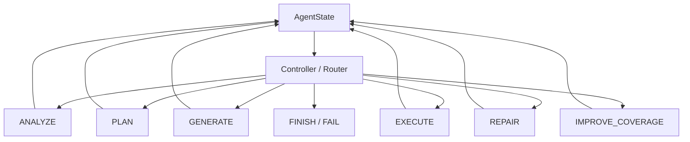

# TestPilot

## 1. 项目简介

TestPilot 是面向中小型 Python 项目的 **project-aware Test Generation Agent**，用于《软件工程与项目实践》Homework 1。它通过项目扫描与 AST 选择上下文，让 DeepSeek 规划和生成测试，再用真实 pytest 与 coverage 反馈修复、补测，输出可审查报告。

核心闭环：Project → Repository Scan / AST → Context Selection → DeepSeek Test Planning → Test Generation → Docker / Local pytest → Failure Repair / Coverage Improvement → Final Report。

它是 **Stateful Tool-Using Agent with Feedback Loops**：保存运行状态、调用工具，并根据观察重新决策，超出简单的“源码 → LLM → pytest”生成流程。技术细节见 [Design.md](Design.md)。

## Demo Video

[▶ 查看 TestPilot 演示视频](TestPilot_Demo.mp4)

## 2. Core Features

- 递归扫描项目，AST 提取函数、类、签名和直接内部依赖。
- 逐模块选择源码与跨模块 context，支持根目录和 `src/` 导入布局。
- DeepSeek 结构化规划与生成，覆盖 normal / boundary / exception / invalid / branch / interaction 行为。
- Docker 优先执行，支持显式 Local 和可配置 fallback。
- pytest traceback 驱动有界 Repair Loop。
- 缺失行与分支驱动有界 Coverage Improvement Loop。
- CLI + Streamlit 共享服务入口，每轮保留计划、测试、观察与报告。

测试数量由行为复杂度决定，**不设人为固定 case 上限**；通过 prompt、`behavior_id`、参数化与保守去重减少低价值重复，保留不同边界、异常和状态变化。

## 3. Agent Architecture



每个节点将 observation 回写 State，Controller 再决定下一步；修复和补测之后必须重新执行测试。实现入口：[graph](testpilot/agent/graph.py)、[controller](testpilot/agent/controller.py)、[state](testpilot/agent/state.py)、[nodes](testpilot/agent/nodes.py)。

## 4. Quick Start

在项目根目录、已初始化 Conda 的终端运行（支持 Python 3.11+）：

```powershell
conda create -n testpilot python=3.13 pip -y
conda activate testpilot
python -m pip install -r requirements.txt
python -m pip install -e . --no-deps --no-build-isolation
```

启动 Docker Desktop 的 Linux 容器后，首次构建镜像并运行无 API 调用的 Demo：

```powershell
docker info
docker build -t testpilot-runner:latest .
testpilot ./examples/edge_cases --demo --runner docker
```

真实 DeepSeek：在启动目录的 `.env` 中填写以下配置（参见 [.env.example](.env.example)），然后运行：

```dotenv
DEEPSEEK_API_KEY=你的真实Key
```

```powershell
testpilot ./examples/basic --runner docker
```

环境变量优先于 `.env`，程序不输出 Key；缺少 Key 会明确失败。Demo 仅支持源码指纹匹配的内置示例，不会静默替代真实模型。

CLI 配置优先级：**`--config` 显式文件 > 当前工作目录 `config.yaml` > 内置默认配置**；未填字段由默认值补齐，`--runner` 可覆盖 YAML，非法配置直接报错。`--target` 选择项目相对模块，`--output` 指定产物父目录；命令不可用时可用 `python -m testpilot`。

Docker 不可用时默认允许回退 Local，请检查报告的 `execution_backend`；设置 `execution.allow_local_fallback: false` 可禁止回退。Local 仅运行可信项目，不是安全沙箱。

Web 入口：`streamlit run testpilot/ui/streamlit_app.py`。支持目录或 ZIP、目标选择及报告下载，默认勾选 Demo；真实调用需取消勾选。Web 自动读取当前目录 config.yaml（不存在时用内置默认），再应用侧栏选项；支持安全目录上传。

## 5. Current Configuration

项目根目录 CLI 当前使用 [config.yaml](config.yaml) 的核心设置：

```yaml
llm:
  model: deepseek-flash
  max_tokens: 50000
agent:
  context_max_chars: 100000
  max_repair_rounds: 2
coverage:
  line_threshold: 80
  branch_threshold: 70
  max_improvement_rounds: 2
```

`max_tokens` 控制单次 LLM 输出；`context_max_chars` 限制 ContextSelector 构造的输入上下文字符数。当前项目 YAML 设置为 **100000**，以实际配置及 UI 摘要为准；[代码内置默认值](testpilot/config.py)仍为 60000，适用于无配置文件的运行，不应混淆。

当前 YAML 的 `max_tokens=50000`，代码默认仍为 16384；UI 显示有效的 Max Output。项目允许范围为 512～393216，上限依据 [DeepSeek Chat Completions 文档](https://api-docs.deepseek.com/api/create-chat-completion/)（2026-10-05 核实）。这是输出上限，不是每次固定生成的长度；输入和输出总量还受模型上下文窗口约束。配置无效时页面会指出字段及校验要求。

## 6. Verified Results

以下为 **2026-10-05 最终验证结果**，已核对 [docs/evidence](docs/evidence/) 中的精选报告与 trace。四个真实 DeepSeek examples 均使用 Docker；Demo 为无真实 API 调用的确定性验证。

| 示例 / 模式 | 后端 | 最终 pytest | 行 / 分支覆盖率 | Repair | 证据 |
|---|---|---|---|---|---|
| basic / DeepSeek | Docker | 15 passed / 0 failed | 100% / 100% | 0 | [报告](docs/evidence/basic-deepseek-docker-20261005-164524-7f17b6d4/final_report.json) |
| multi_module / DeepSeek（3 模块） | Docker | 63 passed / 0 failed | 100% / 100% | 0 | [报告](docs/evidence/multi_module-deepseek-docker-20261005-164029-465d1623/final_report.json) |
| edge_cases / DeepSeek | Docker | 23 passed / 0 failed | 100% / 100% | 0 | [报告](docs/evidence/edge_cases-deepseek-docker-20261005-164554-87831b1b/final_report.json) |
| advanced_project / DeepSeek（6 模块） | Docker | 108 passed / 0 failed | 100% / 100% | 1 | [报告](docs/evidence/advanced_project-deepseek-docker-20261005-164616-893e53e9/final_report.json) · [trace](docs/evidence/advanced_project-deepseek-docker-20261005-164616-893e53e9/trace.json) |
| edge_cases / Demo | Docker | 9 passed / 0 failed | 100% / 100% | 1 | [报告](docs/evidence/edge_cases-demo-docker-20261005-164006-a2cf37bb/final_report.json) · [三轮 trace](docs/evidence/edge_cases-demo-docker-20261005-164006-a2cf37bb/trace.json) |

advanced_project：**首次 106 passed / 2 failed → Repair → 108 passed / 0 failed → 100% line / branch coverage**。这说明 Failure Repair Loop 在真实 DeepSeek + Docker 环境下实际触发并完成；两轮执行记录见 [首次执行](docs/evidence/advanced_project-deepseek-docker-20261005-164616-893e53e9/rounds/01/execution_result.json) 与 [修复后执行](docs/evidence/advanced_project-deepseek-docker-20261005-164616-893e53e9/rounds/02/execution_result.json)。

edge_cases Demo 保留确定性双反馈闭环：**初始 0 passed / 1 failed → Repair 后 1 passed → Coverage Improvement 后 9 passed**，Repair 1 轮、Coverage Improvement 1 轮，最终行 / 分支覆盖率均为 100%。

advanced_project 最新报告明确记录 **82 个 `generated_test_functions`**、**108 个 `collected_test_cases`**。前者统计代码定义，后者统计 pytest 参数化展开后的用例，不能混用。**高覆盖率不等于高测试质量**，这些结果仅代表对应运行与目标源码。

## 7. Advanced Project Highlights

[advanced_project](examples/advanced_project) 的 6 个组件组合 dataclass、Enum、自定义异常与 Decimal 定价，包含优惠券优先于 VIP、库存状态变化、注入时钟和跨模块交互。它要求失败不改变库存，以及多 SKU 扣减的原子性（先全部校验再扣减）；不是并发事务或数据库回滚。具体行为见 [Design.md](Design.md)。

## 8. Outputs

每次运行写入 `runs/<project>-<deepseek|demo>-<docker|local>-<YYYYMMDD-HHMMSS>-<8位随机ID>/`（北京时间 UTC+08:00）：`test_plan.json`、`generated_tests/`、`execution_result.json`、`coverage_result.json`、`final_report.json`、`final_report.md`、`state.json`、`trace.json`、`rounds/`。

这些产物将计划、最终结果和逐轮执行串成可审查的评分证据；提前失败时测试/轮次目录可能不存在，未执行或无覆盖率的数据为 `null`。

- `runs/`：本地原始运行产物，默认被 Git 忽略，不提交仓库。
- [docs/evidence/](docs/evidence/)：从真实 run 产物中筛选复制的最终验证证据，包含真实 DeepSeek 与确定性 Demo 的独立记录，用于 GitHub、课程提交及 README / Design 引用；当前保留原 run 的完整目录名。

真实 LLM 调用另保存 `llm_calls.json`（任务、尝试次数、模型、输出预算、上下文字符数和错误类型；输出截断时记录可用 token 用量）。修复使用局部精确替换，未修改的测试内容原样保留；候选和错误记录在 `repairs/`。模型输出达到长度上限时会有界重试，耗尽后显示明确原因，不将不完整输出视为成功。

项目名经安全 slugify 并截断至 48 字符；同秒运行通过随机 ID 和独占目录创建避免冲突。目录在结束时按实际执行后端更新（例如 Docker 回退为 Local）；没有有效执行结果时保留请求后端，页面显示 `Not executed`。Streamlit 分别显示 Project、Mode、Execution Backend、Run Time，并以小字保留短 ID。下载名使用项目名前缀，如 `advanced_project-final-report.md`、`advanced_project-generated-tests.zip`；JSON 下载为 `<project>-test-plan.json` 和 `<project>-trace.json`，内容仍来自该次 run。

## 9. Testing

在已激活的 `testpilot` 环境运行：

```powershell
python -m pytest
python -m ruff check .
python -m ruff format --check .
```

默认测试使用 Fake/Mock LLM，不需要 Key。真实 Integration Test 会产生 API 调用，需在终端环境中已设置 `DEEPSEEK_API_KEY` 后显式开启（测试不自动加载 `.env`）：

```powershell
$env:TESTPILOT_RUN_INTEGRATION = "1"
python -m pytest tests/integration -v
Remove-Item Env:TESTPILOT_RUN_INTEGRATION
```

该集成测试使用 LocalRunner；上表 Docker 验证来自独立示例运行。

## 10. Rubric Mapping

| 评分项 | 实现 / 证据入口 |
|---|---|
| 功能完整性 40% | [service](testpilot/service.py)、[tools](testpilot/tools)、[runners](testpilot/runners)、[LLM](testpilot/llm)、[examples](examples) |
| Agent 架构 30% | [graph / controller / state / nodes](testpilot/agent)、[真实 Repair trace](docs/evidence/advanced_project-deepseek-docker-20261005-164616-893e53e9/trace.json)、[Demo 双反馈 trace](docs/evidence/edge_cases-demo-docker-20261005-164006-a2cf37bb/trace.json) |
| 代码质量 20% | [typed models](testpilot/schemas)、[config](testpilot/config.py)、[errors](testpilot/errors.py)、[tests](tests)、[ruff 配置](pyproject.toml) |
| 文档 10% | [README](README.md)、[Design](Design.md)、[docs/evidence](docs/evidence) |

## 11. Known Limitations

- 主要面向中小型同步 Python 项目；大型 Django、GPU、分布式和复杂 async 不保证支持。
- AST 是静态近似，仅展开直接内部依赖，不构建完整语义调用图。
- 上下文与文件大小有预算限制；超限需缩小项目、使用 `--target` 或调整预算。
- 高覆盖率不等于高测试质量；断言、去重和测试保留检查仍需人工复核。
- LocalRunner 不是安全沙箱；Docker 也不是生产级多租户隔离。
- 只执行新生成测试，不合并运行已有测试；复杂依赖和构建扩展需自行准备。
- State 仅服务单次 run，当前不支持 checkpoint resume。

HW2 可复用 State / Tools / Runner / LLM Adapter，进一步拆分多 Agent Workflow。
